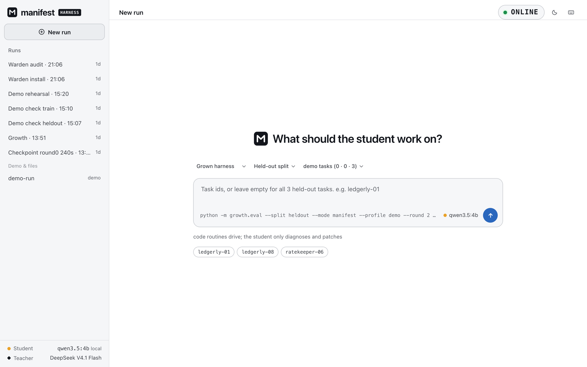
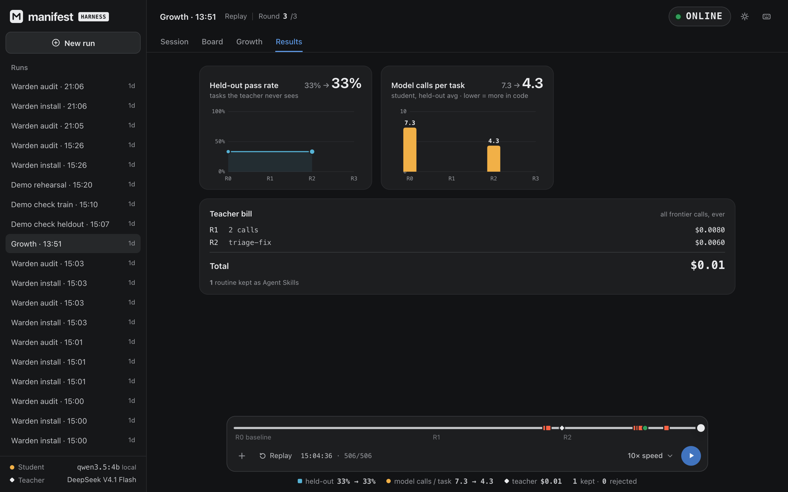
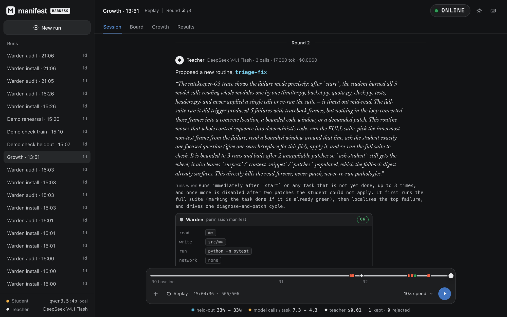

# Manifest

**A coding-agent harness that grows itself.**

A 4B model on a laptop is smart enough to fix most bugs. It fails as an agent because of *process*:
it wanders, loops, and never commits to an edit. Manifest watches it fail on practice tasks. An open
frontier model (DeepSeek V4.1 Flash, MIT open weights) then writes the missing control routines **as
code**. Each routine must win on separate gate tasks and earn a **permission manifest** from **Warden**
before it is kept. After growth, the 4B model (Qwen3.5-4B via Ollama) plus the grown harness runs
**fully offline**.

> Taught once online. Runs offline forever. Your code never leaves your laptop.

Built in one day at a hackathon (October 3, 2026), where it placed **3rd**.

<picture>
  <source media="(prefers-color-scheme: dark)" srcset="docs/images/gui-home-dark.png">
  
</picture>

---

## Results

Every number below is recomputed from the committed event log by `growth/report.py`.
Full tables: [`RESULTS.md`](RESULTS.md). Raw log: `.manifest/runs/20261003-135116-growth.jsonl`.



| | Baseline (plain tool loop) | Grown harness |
|---|---|---|
| Held-out model calls per task | 7.3 | **4.3 (41% fewer)** |
| Held-out pass rate | 1/3 | 1/3 |
| Gate pass rate | 0/3 | **2/3**, no regressions |
| Live-demo task `ledgerly-01` | fail: 8 calls, timed out at 240 s | **pass: 1 call, 8–37 s** |
| Teacher cost, whole run | | **$0.014** |
| Student cost | | $0 (local) |

**What the teacher grew:** [`triage-fix`](routines/grown/triage-fix/routine.py) (140 lines, written by the
teacher; we never edited it). It runs the full suite, follows the traceback to the innermost frame of your
own code, shows the student only that window, asks for one search/replace patch, applies it, and re-runs
the suite. Warden's verdict: **ok**. It writes `src/**` only, runs `python -m pytest` only, and has no network.
It is exported as an Agent Skill in [`skills/triage-fix/`](skills/triage-fix/SKILL.md).


<sub>The GUI replaying the real growth run: the teacher's proposal for <code>triage-fix</code>, in its own words, with Warden's permission manifest. Footer: held-out 33% → 33%, model calls per task 7.3 → 4.3.</sub>

**Why process, not knowledge:** in the round-0 checkpoint every failure was a *process* failure, labelled
by `tasks/labels.py`: 0 knowledge failures and 0 tool-format failures. In 4 of 4 failures the student had
opened the buggy file, then kept reading other files and never edited.

**Read these before quoting the numbers.**
- The sample is small: 3 train / 3 gate / 3 held-out tasks.
- The held-out *pass rate* did not move. `ledgerly-01` flipped to pass, while the unseen-domain task
  `csvflow-01` flipped to fail. The improvement is in model calls and time.
- One growth round was lost to a teacher token cap (now fixed). The run was stopped by hand after round 2.
- All of this is spelled out in `RESULTS.md`.

---

## How it works

```
 practice tasks ──► student (qwen3.5:4b, local) fails ──► failed traces (train split only)
                                                                │
                         teacher (DeepSeek V4.1 Flash) writes ONE routine as Python
                                                                │
              Warden: static scan + teacher explanation ──► permission manifest + verdict
                                                                │
                gate: re-run gate tasks with the routine ──► accept only if better, no regressions
                                                                │
         routines/grown/<name>  +  skills/<name>/ (Agent Skill)  +  registry.json
                                                                │
                      at run time: student + grown routines, offline, under the sandbox
```

| Part | Where | What it does |
|---|---|---|
| Student | `harness/student.py` | Qwen3.5-4B on Ollama, temperature 0, thinking off. Answers only fixed-format, schema-validated questions; an invalid answer is re-asked once. |
| Baseline harness | `harness/loop.py` | A plain tool-calling loop: list, read, run tests, edit, bash. This is round 0. |
| Controller | `harness/controller.py` | A code loop over routines: `applies(state)` decides when a routine fires, `run(state, tools, student)` decides what it does. Control lives in code; the model does only the semantic steps. |
| Teacher | `harness/teacher.py` | Proposes exactly one routine (≤150 lines) per round. Its JSON is validated and retried once, and cost and cache hits are logged. |
| Growth loop | `growth/grow.py`, `growth/gate.py` | Runs the rounds. A leak check refuses any teacher prompt that mentions a held-out task. |
| Warden | `warden/` | Static scan (AST + regex + decode-then-exec), a permission manifest, and enforcement through macOS `sandbox-exec` with `HOME` set to a fake home. |
| Tasks | `tasks/` | 26 scored tasks plus 2 live-demo tasks across 5 services. Bug shapes are mechanically verified. See [`tasks/README.md`](tasks/README.md). |
| Runner | `growth/eval.py` | Runs any harness over a split and judges each result **independently**: it re-runs the real suite and fails any run that edited, added or deleted test files. |
| GUI | `gui/` | Replays or live-tails the event log, and can start runs. See [`gui/README.md`](gui/README.md). |

Every component writes one append-only event log (`.manifest/runs/*.jsonl`, schema in
[`CONTRACT.md`](CONTRACT.md)). The GUI, `RESULTS.md` and the failure labeller all read only that log.

### What makes the evaluation trustworthy
- **Verified bug shapes.** `python -m tasks.gen` refuses to emit a task unless its labels hold. For
  example, a *regression trap* must have a tempting local fix that provably breaks a test that was passing.
- **The harness never grades itself.** The runner decides pass/fail, and tampering with tests is a fail.
- **No leakage.** Root causes live only in `tasks/index.json`. The teacher sees only train traces.
  Held-out includes a whole domain (`csvflow`) the teacher never sees.
- **A fair baseline.** Both harnesses get the same 240 s per task. Failures are labelled
  `process / knowledge / format / budget`, so a broken tool-call format or a starved machine can't
  masquerade as a result.

### Warden, live
```bash
uv run manifest warden audit demo/thirdparty-skills/quick-fix-pro    # DANGEROUS: reads ~/.ssh, phones home, hides it
uv run manifest skill add demo/thirdparty-skills/quick-fix-pro --force-run   # runs under the sandbox: blocked, sink gets nothing
uv run manifest warden audit skills/triage-fix                       # the grown routine: OK within the default grant
```
The `warden` Agent Skill ([`skills/warden/`](skills/warden/SKILL.md)) does the same audit inside Claude Code,
Codex and any other agent that supports Agent Skills. CI validates every exported skill against the spec.

---

## Run it

Requirements: macOS (for `sandbox-exec`), Python 3.11+, [uv](https://docs.astral.sh/uv/), Node 20+, and
Ollama **0.35 or newer** (older versions cannot pull `qwen3.5`).

```bash
uv sync
brew install ollama && brew services start ollama
ollama pull qwen3.5:4b
cp .env.example .env          # only needed for growth runs: DEEPSEEK_API_KEY, TEACHER_MODEL=deepseek-flash
```

**The live demo** (grown harness, offline, about 1 minute in total):
```bash
uv run python -m growth.eval --split heldout --profile demo --mode manifest --round 2 --max-seconds 240
```

**The GUI** (or press *New run* there; it defaults to the demo above):
```bash
cd gui && npm install && npm run serve      # http://127.0.0.1:4173, works with Wi-Fi off
```

**Everything else:**
```bash
uv run python -m growth.eval --split train --mode baseline --round 0 --profile core   # baseline (cached once run)
uv run python -m growth.grow --rounds 4 --profile core                               # a growth run (needs the teacher)
uv run python -m growth.grow --fake-teacher --stub-runner --rounds 2                 # rehearsal, no models
uv run python -m growth.report .manifest/runs/<run>.jsonl -o RESULTS.md              # results from a log
uv run python -m tasks.labels  .manifest/runs/<run>.jsonl                            # why tasks failed
uv run python -m tasks.gen                                                           # rebuild + verify all tasks
uv run pytest                                                                        # 180 tests
```

---

## Repository

```
tasks/       generator, verified mutations, 5 template services, splits (core / full / demo), labeller
harness/     student, teacher, tools (path jail + manifest checks), baseline loop, controller, event log
routines/    seed/ (start, ask-student: hand-written, minimal)   grown/ (teacher-written only)
growth/      growth loop, gate, trace compression, runner (eval.py), report
warden/      scan, manifest, sandbox (sandbox-exec), CLI with the permission card
skills/      exported Agent Skills: triage-fix (grown) and warden
gui/         Vite + React viewer and launcher
demo/        rigged third-party skill, fake home with a fake ~/.ssh key, localhost sink
```

## Prior work
Builds on *"Grow the Harness, Not the Context"* (arXiv 2609.26760). Our additions:
- the coding domain with mechanically verified bug shapes;
- grown routines exported as Agent Skills;
- Warden as a gate on teacher-written code and as runtime enforcement;
- fully offline deployment of the grown harness.

## Disclosures
- **No starter templates.** Everything was written during the event.
- **AI-assisted build.** The code was written with AI coding agents (Claude Code) working in five parallel
  git worktrees, against the shared [`SPEC.md`](SPEC.md) and [`CONTRACT.md`](CONTRACT.md); a human integrated.
  The GUI design used the Impeccable design skill.
- **Grown routines are teacher-written.** `routines/grown/` and `skills/triage-fix/` come from the teacher
  and were never hand-edited. Their origin is in the growth log (`growth.proposal`).
- **Deviations from the spec,** each explained in `RESULTS.md`:
  - 240 s per task instead of 120 s, for both harnesses;
  - the `core` 3/3/3 profile for the growth run;
  - the teacher's API id is `deepseek-flash`, because the API rejects `deepseek-v4.1-flash`;
  - the GUI can launch runs, though only through the documented CLIs with allow-listed arguments.
- **Font:** Newsreader via `@fontsource-variable/newsreader` (SIL OFL), bundled for offline use.

## License
MIT. See [LICENSE](LICENSE).
